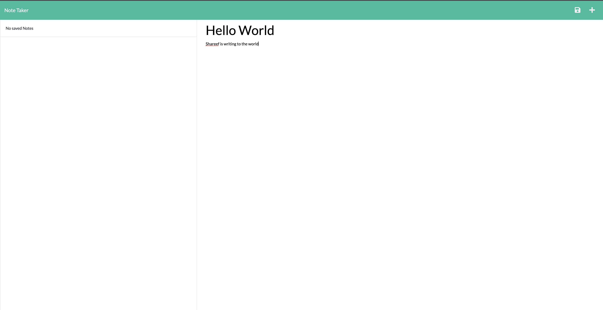
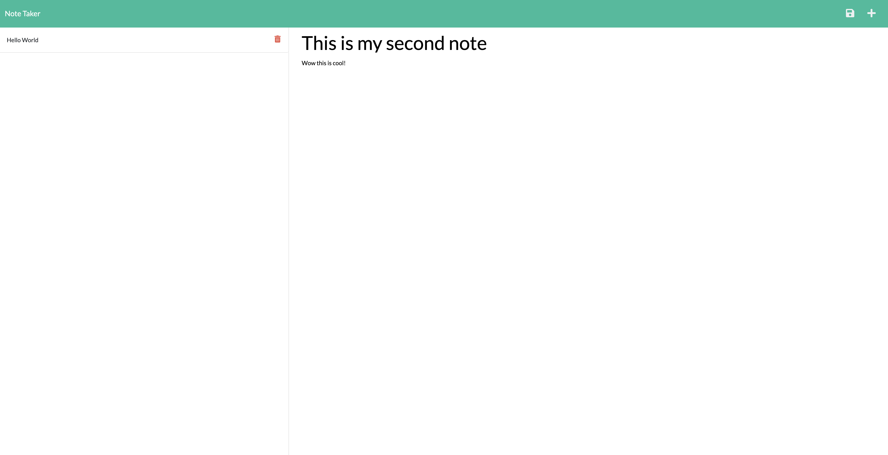

# got-notes-ohya

## Table of Contents:

- [Description](#description)
- [Questions](#questions)

### Description

I created an application called Note Taker that can be used to write and save notes. This application uses an Express.js back end and will save and retrieve note data from a JSON file.  

The following images shows the web application's appearance and functionality:  

### Questions?

- Check out my [Github](https://github.com/sabrtraveler).
- Reach me by email at shareefrossetti@gmail.com
